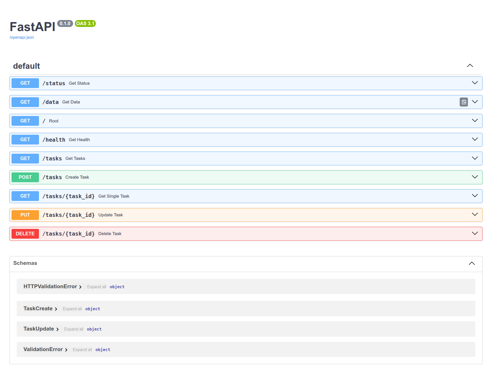

# Task API

A minimal FastAPI backend built from scratch as a full CRUD (Create, Read, Update, Delete) service. It manages an in-memory list of tasks, with input validation, proper HTTP status codes, and interactive Swagger documentation.

## What this is

This project demonstrates the core building blocks every backend is made of:
- A running HTTP server
- JSON endpoints that describe and expose data
- Full CRUD operations on a resource (`tasks`)
- Input validation and correct error handling (400, 404)
- Auto-generated interactive API docs (Swagger UI)

## Install & Run

```bash
python3 -m venv venv && source venv/bin/activate && pip install -r requirements.txt && uvicorn main:app --reload --port 3000
```

Server runs at: `http://localhost:3000`
Interactive docs (Swagger UI): `http://localhost:3000/docs`

## Endpoints

| Method | Path          | Description                            | Success | Error Cases                             |
|--------|---------------|------------------------------------------|---------|-------------------------------------------|
| GET    | `/`           | API info (name, version, endpoints)      | 200     | —                                          |
| GET    | `/health`     | Health check                             | 200     | —                                          |
| GET    | `/tasks`      | List all tasks                           | 200     | —                                          |
| GET    | `/tasks/{id}` | Get a single task by id                  | 200     | 404 — task not found                       |
| POST   | `/tasks`      | Create a new task                        | 201     | 400 — missing/empty title                  |
| PUT    | `/tasks/{id}` | Update a task's title and/or done status | 200     | 404 — task not found; 400 — invalid body   |
| DELETE | `/tasks/{id}` | Delete a task                            | 204     | 404 — task not found                       |

## Example Requests

**Root endpoint**
```bash
curl -i http://localhost:3000/
```


**Health check**
```bash
curl -i http://localhost:3000/health
```


**List all tasks**
```bash
curl -i http://localhost:3000/tasks
```


**Get a single task**
```bash
curl -i http://localhost:3000/tasks/1
```


**Create a task**
```bash
curl -i -X POST http://localhost:3000/tasks \
  -H "Content-Type: application/json" \
  -d '{"title":"Buy milk"}'
```


**Update a task**
```bash
curl -i -X PUT http://localhost:3000/tasks/1 \
  -H "Content-Type: application/json" \
  -d '{"done": true}'
```


**Delete a task**
```bash
curl -i -X DELETE http://localhost:3000/tasks/1
```

## Sample Output

```
### API Information

> Out_1:
HTTP/1.1 200 OK
date: Thu, 16 Jul 2026 12:02:00 GMT
server: uvicorn
content-length: 58
content-type: application/json

{"name":"Task API","version":"1.0","endpoints":["/tasks"]}
```

```
### Health check

> out_2:
 http://localhost:3000/health
HTTP/1.1 200 OK
date: Thu, 16 Jul 2026 12:02:29 GMT
server: uvicorn
content-length: 15
content-type: application/json

{"status":"OK"}(venv)
```

```
### List All Tasks

> out_3:
HTTP/1.1 200 OK
date: Thu, 16 Jul 2026 12:03:07 GMT
server: uvicorn
content-length: 213
content-type: application/json

[{"id":0,"title":"Your FIRST Order Is Here","done":false},{"id":1,"title":"Your SECOND Order Is Here","done":true},{"id":2,"title":"Your THIRD Order Is Here","done":false},{"id":3,"title":"Buy milk","done":false}](venv)
```

```
### get a task by ID

> out_4:
i http://localhost:3000/tasks/1
HTTP/1.1 200 OK
date: Thu, 16 Jul 2026 12:03:29 GMT
server: uvicorn
content-length: 56
content-type: application/json

{"id":1,"title":"Your SECOND Order Is Here","done":true}(venv)
```

```
### Create a new Task with condition of compulsary title
> out_5:

cation/json" -d '{"title":"Buy milk"}'
HTTP/1.1 201 Created
date: Thu, 16 Jul 2026 12:00:33 GMT
server: uvicorn
content-length: 40
content-type: application/json

{"id":3,"title":"Buy milk","done":false}(venv)
```


```
### Update a Task

>out_6:
HTTP/1.1 200 OK
date: Thu, 16 Jul 2026 12:04:15 GMT
server: uvicorn
content-length: 56
content-type: application/json

{"id":1,"title":"Your SECOND Order Is Here","done":true}(venv)
```

```
### Delete a Task

>out_7:
curl -i -X DELETE http://localhost:3000/tasks/1
HTTP/1.1 204 No Content
date: Thu, 16 Jul 2026 12:04:34 GMT
server: uvicorn
content-type: application/json
```

## Swagger UI

Interactive documentation is auto-generated by FastAPI at `/docs`. All endpoints can be tested directly from the browser using "Try it out" — no curl required.



## Project Structure
smallest-backend/
├── main.py              # FastAPI app with all routes
├── requirements.txt      # Python dependencies
├── swagger-screenshot.png
└── README.md

## Tech Stack

- Python 3
- FastAPI
- Uvicorn (ASGI server)
- Pydantic (request validation)

## Build Log (Stages)

| Stage | What was built |
|-------|------------------|
| 0 | Hello-server on localhost |
| 1 | `GET /` and `GET /health` endpoints |
| 2 | `GET /tasks` and `GET /tasks/{id}` with 404 handling |
| 3 | `POST /tasks` with validation (400 on empty title) |
| 4 | `PUT /tasks/{id}` and `DELETE /tasks/{id}` — full CRUD complete |
| 5 | Swagger UI docs at `/docs` |
| 6 | Published to GitHub with documentation |
